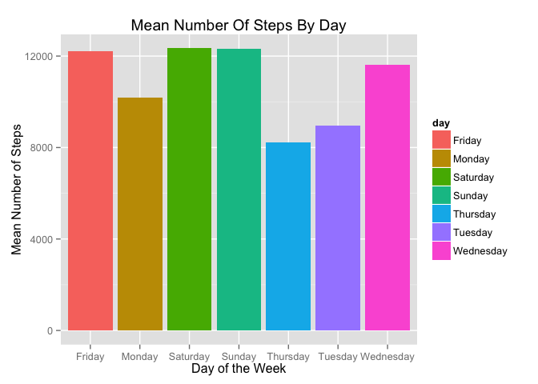

# Reproducible Research: Peer Assessment 1
#Programming Assignment #1
Kevin Dysart  
December 20th, 2015  

##Call the appropriate packages.  
For this assignment I will be utlizing the dplyr, xtable, knitr, mice, lattice and ggplot2 packages.

```r
library("dplyr")
```

```
## 
## Attaching package: 'dplyr'
## 
## The following objects are masked from 'package:stats':
## 
##     filter, lag
## 
## The following objects are masked from 'package:base':
## 
##     intersect, setdiff, setequal, union
```

```r
library("ggplot2")
library("xtable")
library("knitr")
library("mice")
```

```
## Loading required package: Rcpp
## mice 2.25 2015-11-09
```

```r
library("lattice")
```

##Reading data file into R.
The first step in the process is to load the data into R. The assignment states that the file  
may be downloaded directy from the site and then loaded in the R from a local drive.  

I downloaded the file and then stored it locally. I then read the file into R with the following  
code assigning it to the object, activity.  


```r
setwd("~/GitHub/RepData_PeerAssessment1")
activity <- read.csv("activity.csv")
```

## Summary of the original dataset.  
As a first step I simply call summary on the object to have a look at the variables.  

```r
summary(activity)
```

```
##      steps                date          interval     
##  Min.   :  0.00   2012-10-01:  288   Min.   :   0.0  
##  1st Qu.:  0.00   2012-10-02:  288   1st Qu.: 588.8  
##  Median :  0.00   2012-10-03:  288   Median :1177.5  
##  Mean   : 37.38   2012-10-04:  288   Mean   :1177.5  
##  3rd Qu.: 12.00   2012-10-05:  288   3rd Qu.:1766.2  
##  Max.   :806.00   2012-10-06:  288   Max.   :2355.0  
##  NA's   :2304     (Other)   :15840
```
##Redefining data frame and converting to table data frame.
I am going to convert the data frame to a table data frame. While there are many ways to accomplish  
the initial goals of summarizing the data and presenting the sum, mean and median answers  
for the first set of questions I find simply using summarize the most efficient.  
I first redefine and group on the date variable.

```r
activity <- tbl_df(activity)
activity_a <- group_by(activity, date)
```
##Questions to be answered in this project.
###What is mean total number of steps taken per day?  
For this part of the assignment, you can ignore the missing values in the dataset.

```r
sum_activity <- summarize(activity_a, sum = sum(steps))
mean_sum <- mean(sum_activity$sum, na.rm=TRUE, digits=3)
median_sum <- median(sum_activity$sum, na.rm=TRUE)
sum_activity_tab <- xtable(sum_activity)
```

1. Calculate the total number of steps taken per day.  
The following table presents the sum for each day in the data set.

```r
knitr::kable(sum_activity_tab, ,format="markdown", digits=2, align="c",
             format.args=list(justify=c("centre"), width=2))
```


|    date    |  sum  |
|:----------:|:-----:|
| 2012-10-01 |  NA   |
| 2012-10-02 |  126  |
| 2012-10-03 | 11352 |
| 2012-10-04 | 12116 |
| 2012-10-05 | 13294 |
| 2012-10-06 | 15420 |
| 2012-10-07 | 11015 |
| 2012-10-08 |  NA   |
| 2012-10-09 | 12811 |
| 2012-10-10 | 9900  |
| 2012-10-11 | 10304 |
| 2012-10-12 | 17382 |
| 2012-10-13 | 12426 |
| 2012-10-14 | 15098 |
| 2012-10-15 | 10139 |
| 2012-10-16 | 15084 |
| 2012-10-17 | 13452 |
| 2012-10-18 | 10056 |
| 2012-10-19 | 11829 |
| 2012-10-20 | 10395 |
| 2012-10-21 | 8821  |
| 2012-10-22 | 13460 |
| 2012-10-23 | 8918  |
| 2012-10-24 | 8355  |
| 2012-10-25 | 2492  |
| 2012-10-26 | 6778  |
| 2012-10-27 | 10119 |
| 2012-10-28 | 11458 |
| 2012-10-29 | 5018  |
| 2012-10-30 | 9819  |
| 2012-10-31 | 15414 |
| 2012-11-01 |  NA   |
| 2012-11-02 | 10600 |
| 2012-11-03 | 10571 |
| 2012-11-04 |  NA   |
| 2012-11-05 | 10439 |
| 2012-11-06 | 8334  |
| 2012-11-07 | 12883 |
| 2012-11-08 | 3219  |
| 2012-11-09 |  NA   |
| 2012-11-10 |  NA   |
| 2012-11-11 | 12608 |
| 2012-11-12 | 10765 |
| 2012-11-13 | 7336  |
| 2012-11-14 |  NA   |
| 2012-11-15 |  41   |
| 2012-11-16 | 5441  |
| 2012-11-17 | 14339 |
| 2012-11-18 | 15110 |
| 2012-11-19 | 8841  |
| 2012-11-20 | 4472  |
| 2012-11-21 | 12787 |
| 2012-11-22 | 20427 |
| 2012-11-23 | 21194 |
| 2012-11-24 | 14478 |
| 2012-11-25 | 11834 |
| 2012-11-26 | 11162 |
| 2012-11-27 | 13646 |
| 2012-11-28 | 10183 |
| 2012-11-29 | 7047  |
| 2012-11-30 |  NA   |

2. If you do not understand the difference between a histogram and a barplot, research the difference between them. Make a histogram of the total number of steps taken each day.  
The following histogram simply presents the sum of each day over the sampling  
time period.

```r
hist(sum_activity$sum, col = "blue",
     xlab="Sums",
     main="Histogram For Sum Of Steps Per Day")
```

 

3. Calculate and report the mean and median of the total number of steps taken per day.  
The mean of the number of steps per day is 1.0766189\times 10^{4} and the median of the number  
of steps per day is 10765.

```r
print(mean_sum)
```

```
## [1] 10766.19
```

```r
print(median_sum)
```

```
## [1] 10765
```

###What is the average daily activity pattern?  
1. Make a time series plot (i.e. type = "l") of the 5-minute interval (x-axis) and the average number of steps taken, averaged across all days (y-axis).  
My interpretation of this question led me to group the data set in the interval variable and then  
produce a mean number of steps per interval and then create the time series plot.  
Since we have not yet been asked to deal with imputing the missing variables I will  
simply remove the NA values.

```r
activity_interval_group <- group_by(activity, interval)
activity_interval_mean <- summarize(activity_interval_group, mean_steps=mean(steps, na.rm=TRUE))
plot(activity_interval_mean$interval, activity_interval_mean$mean_steps, 
     xlab="Interval", 
     ylab="Mean Steps", 
     main="Time Series Of Interval And Mean Number Of Steps",
     type="l",
     col="blue")
```

 

2. Which 5-minute interval, on average across all the days in the dataset, contains the maximum number of steps?
In order to answer this question I simply sorted the data frame and then assigned the  
first row to a new object I then print.


```r
activity_interval_mean_sort <- arrange(activity_interval_mean, desc(mean_steps))
max_steps <- (activity_interval_mean_sort[1,])
print(max_steps)
```

```
## Source: local data frame [1 x 2]
## 
##   interval mean_steps
## 1      835   206.1698
```

Thus the interval associated with the highest mean number of steps is, 835,  
with 206.1698113 number of steps on average.  

###Imputing missing values
Note that there are a number of days/intervals where there are missing values (coded as NA). The presence of missing days may introduce bias into some calculations or summaries of the data.

1. Calculate and report the total number of missing values in the dataset (i.e. the total number of rows with NAs).  
The most simple way to do this for me was to simply call summary on the activity  
dataset. I have already done this above and the only variable with missing data is the  
steps variable with 2304 missing fields. Thus this is the number of missing values.  
Another way to handle this and the questions to come is to utilize the mice package  
in R.


```r
missing_activity <- md.pattern(activity)
print(missing_activity)
```

```
##       date interval steps     
## 15264    1        1     1    0
##  2304    1        1     0    1
##          0        0  2304 2304
```

The same information is provided here as previously but with more detail. It can be seen  
that the steps variable is the only one with missing values.

2. Devise a strategy for filling in all of the missing values in the dataset. The strategy does not need to be sophisticated. For example, you could use the mean/median for that day, or the mean for that 5-minute interval, etc.  

There is much written on this topic in the statistical literature. There is no perfect solution.  
A solution that makes sense is to replace the missing values for any time period   
with the mean for that time period. Since we have already created a data set  
with the mean values for each time set we could simply loop through the original data set and  
replace the missing value with the mean for that 5-minute interval.
A multiple imputation method can also be used and there are multiple packages written in R to  
handle this. The mice package mentioned above is one.

3. Create a new dataset that is equal to the original dataset but with the missing data filled in.

Presented here is the code for the creation of a new data set utilizing the mice package.  
Also presented is a scatterplot of both the imputed data (red) and the observed data (blue)  
that graphically displays the distribution of each. The similar shapes for days with missing  
values is reassuring.


```r
tempData <- mice(activity, m=5, meth='pmm')
```

```
## 
##  iter imp variable
##   1   1  steps
##   1   2  steps
##   1   3  steps
##   1   4  steps
##   1   5  steps
##   2   1  steps
##   2   2  steps
##   2   3  steps
##   2   4  steps
##   2   5  steps
##   3   1  steps
##   3   2  steps
##   3   3  steps
##   3   4  steps
##   3   5  steps
##   4   1  steps
##   4   2  steps
##   4   3  steps
##   4   4  steps
##   4   5  steps
##   5   1  steps
##   5   2  steps
##   5   3  steps
##   5   4  steps
##   5   5  steps
```

```r
tempData$meth
```

```
##    steps     date interval 
##    "pmm"    "pmm"    "pmm"
```

```r
complete_activity <- complete(tempData,1)
xyplot(tempData, steps~date,pch=18,cex=1)
```

 

This plot demonstrates where missing data is contained and the pattern of replacement.  
There are 8 days it seems with the majority of the missing data. The pattern of imputation  
seems plausible and appropriate.  

4. Make a histogram of the total number of steps taken each day and Calculate and report the mean and median total number of steps taken per day. Do these values differ from the estimates from the first part of the assignment? What is the impact of imputing missing data on the estimates of the total daily number of steps?


```r
complete_activity <- tbl_df(complete_activity)
complete_activity_a <- group_by(complete_activity, date)
sum_complete_activity <- summarize(complete_activity_a, sum = sum(steps))
hist(sum_complete_activity$sum, col = "red",
     xlab="Sums",
     main="Histogram For Sum Of Steps Per Day")
```

 

Simply by inspecting the differnces between the initial histogram and the current version  
it can be seen that there is actually very little difference between the two. The  
only noticible small change bewteen them is specifically in the bin that represents 15,000 to  
20,000 steps. But for the sake of the assignmnet I am going to mov forward with this  
data set. I experimented with other methods available in the mice package and did  
some further reading but ultimately settled on the predicted mean method (pmm).

5. Are there differences in activity patterns between weekdays and weekends?
Here I need to create a new variable converting each date to a day. From this  
point forward I will be using the new complete data set.

```r
complete_activity$day <- weekdays(as.Date(complete_activity$date))
complete_activity_c <- group_by(complete_activity, date, day)
sum_complete_activity_day <- summarize(complete_activity_c, sum_steps = sum(steps))
sum_complete_activity_day$day <- as.factor(sum_complete_activity_day$day)
mean_complete_activity_day <- group_by(sum_complete_activity_day, day)
mean_complete_activity_day_a <- summarize(mean_complete_activity_day, mean_steps=mean(sum_steps))
q <- ggplot(mean_complete_activity_day_a, aes(day, mean_steps))
p <- q + geom_bar(stat="identity", aes(fill = day)) +
  ggtitle("Mean Number Of Steps By Day") +
  ylab("Mean Number of Steps") +
  xlab("Day of the Week")
print(p)
```

 

###For this part the weekdays() function may be of some help here. Use the dataset with the filled-in missing values for this part.

1. Create a new factor variable in the dataset with two levels – “weekday” and “weekend” indicating whether a given date is a weekday or weekend day.  

Smilar to the code needed for the assignment above I create a weekday variable in the data  
set and then I re-code that variable into yet another for weekend vs. weekday. I have already  
added a weeday variable, day, to the complete activity data set. I will simply add this  
new variable for defining weekend and weekday to that data set.

```r
complete_activity$week <- ifelse(complete_activity$day %in% 
                        c("Monday", "Tuesday", "Wednesday", "Thursday", "Friday"), 
                        "Weekday",
                        "Weekend")
complete_activity$week <- as.factor(complete_activity$week)
complete_activity$day <- as.factor(complete_activity$day)
```
2. Make a panel plot containing a time series plot (i.e. type = "l") of the 5-minute interval (x-axis) and the average number of steps taken, averaged across all weekday days or weekend days (y-axis). See the README file in the GitHub repository to see an example of what this plot should look like using simulated data.  
Using the above data set for complete activity I reduced the interval data similar to  
the previous computations for mean steps across the 5-minute intervals.

```r
complete_activity_interval_group <- group_by(complete_activity, interval, week)
complete_activity_interval_mean <- summarize(complete_activity_interval_group, mean_steps=mean(steps))
xyplot(mean_steps~interval|week, 
       data=complete_activity_interval_mean, 
       type="l", 
       layout=c(1,2), 
       main="Mean Steps Per Interval Weekend vs Weekday", 
       ylab="Mean Steps", 
       xlab="Interval")
```

 

From the above plot one can graphically see the differences between the Weekend and Weekday  
patterns.
